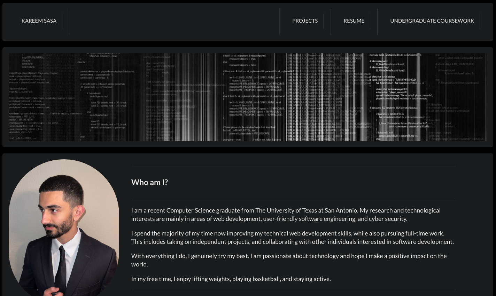

<div align="center">

# [portfolio](https://portfolio-rose-omega.vercel.app)
[](https://vercel.com?utm_source=smakosh&utm_campaign=oss)

</div>



<div align="center">

## Run project locally

### `npm start`

Runs the app in the development mode.\
Open [http://localhost:3000](http://localhost:3000) to view it in the browser.

The page will reload if you make edits.\
You will also see any lint errors in the console.

</div>

## Structure

```bash
├── public
│   └── index.html
│   └── images
├── src
│   └── components
│   │   │── Coursework.js
│   │   │── Home.js
│   │   └── Projects.js
│   │   └── Readings.js
│   │   └── Resume.js
│   ├── patterns
│   │   │── Accordion.js
│   │   │── Footer.js
│   │   └── Header.js
│   │   └── HeaderImage.js
│   │   └── HeaderItem.js
│   │   └── Main.js
│   │   └── SecondaryHeader.js
│   │   └── Section.js
│   │   └── UnorderedList.js
│   └── App.js
└────── index.js
```
